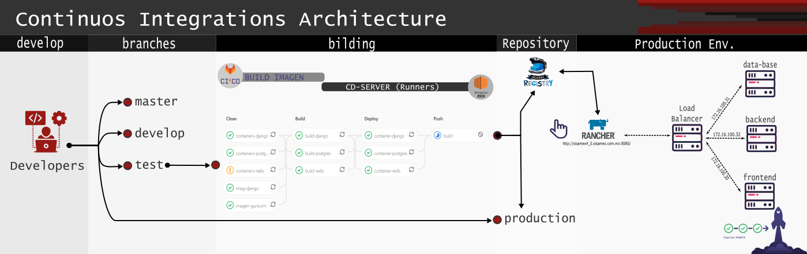

# IMPACTO-ANALYTICS: Plataforma Predictiva de Sisamex (FOMIX)
# Version V1.0

DESCRIPCIÓN: Proyecto Fomix, desarrollo de una plataforma predictiva para mantenimiento, calidad y producción.
Entregable. Predictivos en tiempo real para cada uno de los clientes.

## Funcionalidades disponibles por versiones.

| Funciones                                     | v1.0  |
| :---                                          | :---: |
| Maquetado de Frontend (Admin)                 | OK    |
| Maquetado del Frontend (Cliente)              | D     |
| Maquetado del Backend                         | D     |
| Conexión a fuentes de datos mediante API-REST | P     |
| Desarrollo de modelos para Calidad            | D     |
| Conexión de Tareas Asíncronas                 | D     |


OK: Funcionalidad incorporada.
X : Funcionalidad eliminada.
D : Funcionalidad en desarrollo.
P : Previsto a desarrollar

## Integración Continua.


## Instrucciones para armar el proyecto.

## Servidor Linux/Windows.
Es necesario instalar en la computadora host los paquetes:
1. Docker         [https://runnable.com/docker/install-docker-on-linux]
2. Docker-compose [https://docs.docker.com/compose/install/]
3. Git            [https://git-scm.com/downloads]

## Instrucciones

Ejecutar base de datos. Nota: Este paso solo para pruebas en LocalHOST

```
cd proyecto
docker-compose -f backend_localhost.yml up -d postgres
```

### Ejecutar backend django de forma manual. (Instalar requirment.txt)



#### Configurar .env dentro del proyecto.

Inicializar proyecto con Django.  
```
cd smx_analytics
python manage.py makemigrations
python manage.py migrate
python manage.py createsuperuser
```
